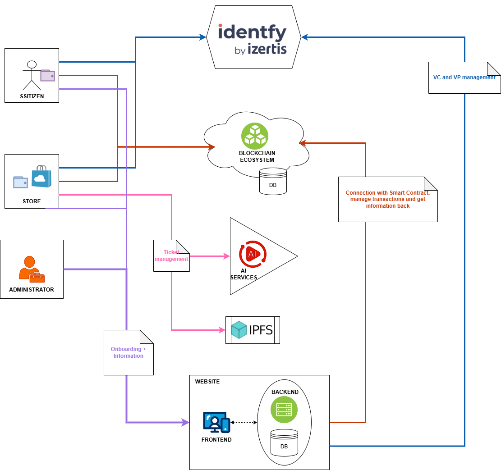

# SSITIZENS

This document provides a high-level overview of the system architecture, detailing the components across the **Blockchain**, **Backend**, and **Frontend** layers. Each module is described with its purpose, implementation details, and current status. For more in-depth technical information, setup instructions, and usage guidelines, refer to the linked `README.md` files in each section.

## Table of Contents

- [SSITIZENS](#ssitizens)
  - [Table of Contents](#table-of-contents)
  - [Architecture](#architecture)
  - [Blockchain Side](#blockchain-side)
    - [Smart Contract](#smart-contract)
    - [Tokenization API](#tokenization-api)
    - [Wallet Library](#wallet-library)
  - [Backend Side](#backend-side)
    - [Ticket Management](#ticket-management)
    - [SSI Connector](#ssi-connector)
    - [SSE (Server-Sent Events)](#sse-server-sent-events)
    - [Ssitizens App / Administrator](#ssitizens-app--administrator)
  - [Frontend Side](#frontend-side)
    - [Website](#website)
    - [Holder Wallet](#holder-wallet)
- [TODO DESPLIEGUE CONJUNTO](#todo-despliegue-conjunto)
  - [📢 Credits](#-credits)

## Architecture

<p align="center">
  
</p>


## Blockchain Side

This section includes all blockchain-related components that form the foundation of the platform’s decentralized infrastructure. These modules handle token logic, smart contract interactions, and wallet functionalities. Together, they ensure secure, transparent, and upgradeable operations across the system.

### Smart Contract
A modular and upgradeable smart contract that manages token issuance, transfers, and redemption. It includes role control, compensation logic, and security mechanisms such as pausability. Implemented using a proxy architecture to allow secure upgrades. 
**Status:** Completed
**Readme:** : [See detailed README](https://github.com/NGI-TRUSTCHAIN/SSITIZENS/blob/main/ssitizens-smart-contract/README.md)

### Tokenization API
A Node.js and TypeScript-based API that enables interaction with smart contracts. It includes RPC functions for token issuance, distribution, and redemption, as well as REST endpoints for querying balances and events. 
**Status:** Completed
**Readme:** : [See detailed README](https://github.com/NGI-TRUSTCHAIN/SSITIZENS/blob/main/ssitizens-tokenization-api/README.md)
### Wallet Library
A TypeScript library designed for integration into frontend applications (web and mobile). It supports QR code generation and scanning, token balance queries, token transfers and burning, and backend communication for ticket processing. 
**Status:** Completed
**Readme:** : [See detailed README](https://github.com/NGI-TRUSTCHAIN/SSITIZENS/blob/main/tokenization-lib-wallet/README.md)

## Backend Side

The following components make up the backend infrastructure of the system. Each module plays a critical role in processing data, managing identities, issuing credentials and tokens, and enabling real-time communication. Together, they ensure secure, intelligent, and seamless backend operations that support the entire platform.
**Status:** Completed
**Readme:** : [See detailed README](https://github.com/NGI-TRUSTCHAIN/SSITIZENS/blob/main/ssitizens-backend/README.md)

### Ticket Management
An AI-powered service that analyzes receipt images to identify subsidizable products. It uses multimodal models deployed on Azure OpenAI and prompt engineering techniques for product extraction and classification. 

### SSI Connector
A module that manages the issuance, presentation, and validation of verifiable credentials. It enables QR code generation for authentication workflows and issues credentials after identity verification. 

### SSE (Server-Sent Events)
A service that enables real-time communication from the backend to the frontend. It is used to notify events such as credential issuance, token distribution, or status updates. 

### Ssitizens App / Administrator
A Django-based backend that manages user profiles, transactions, token and credential issuance. It includes administrative tools for monitoring, reporting, and user management. 

## Frontend Side

The following components form the frontend layer of the platform. These interfaces allow users—including citizens, merchants, and administrators—to interact with the system through web and mobile applications. They provide access to identity management, token operations, and real-time updates, ensuring a seamless and user-friendly experience.


### Website
A web portal built with React and TypeScript that allows citizens, merchants, and administrators to interact with the system. It includes authentication, user management, transaction viewing, and token issuance. 
**Status:** Completed
**Readme:** : [See detailed README](https://github.com/NGI-TRUSTCHAIN/SSITIZENS/blob/main/ssitizens-frontend/README.md)

### Holder Wallet
A cross-platform mobile app developed in React Native that allows citizens and merchants to manage their digital identities and tokens. It includes biometric authentication, QR scanning, payments, and token-to-euro conversion requests. 
**Status:** Completed
> **Note:** The source code for this application is not publicly available. However, it integrates the publicly available tokenization library to handle wallet-related operations.

---
# TODO DESPLIEGUE CONJUNTO

En caso de encontrar el siguiente error:

```bash
[INFO] Iniciando despliegue en modo full...
[SUCCESS] El archivo .env existe y todas las variables están configuradas.
unknown flag: --profile

Usage:  docker [OPTIONS] COMMAND [ARG...]

Run 'docker --help' for more information

```
```bash
[INFO] Iniciando despliegue en modo full...
[SUCCESS] El archivo .env existe y todas las variables están configuradas.
docker: unknown command: docker compose

Run 'docker --help' for more information
```
Es porque se está se está utilizando dentro del `setup.sh` el comando `docker compose`, habría que sustituirlo en base
al comando que se utilize de `docker compose` en la máquina host. Habría que reemplazar todos los `docker compose` del fichero por
`docker-compose` (o viceversa).

Funcionamiento del setup.sh (`./setup.sh --help`)

```bash
Opciones:
  --deploy --mode <demo|dev|full> [--build] [--detach] [--verbose]
    - demo: Despliega servicios básicos.
    - dev: Incluye servicios adicionales.
    - full: Despliegue completo.
    - --build: Reconstruye imágenes.
    - --detach: Ejecuta en segundo plano.
    - --verbose: Salida detallada.

  --manage <docker|--ports <demo|dev|full>|env|containers|stop|clean>
    - docker: Verifica instalación.
    - --ports: Verifica puertos.
    - env: Genera archivo de variables de entorno (.env).
    - containers: Estado de contenedores.
    - stop: Detiene contenedores.
    - clean: Limpia contenedores huérfanos.

  --help
    Muestra esta ayuda.

Ejemplos:
  Desplegar en modo dev:
    ./setup.sh --deploy --mode dev --build --detach
  Generar variables de entorno:
    ./setup.sh --manage env
  Detener contenedores:
    ./setup.sh --manage stop
  Limpiar contenedores huérfanos:
    ./setup.sh --manage clean
  Estado de contenedores:
    ./setup.sh --manage containers
  Verificar puertos:
    ./setup.sh --manage --ports dev
  Mostrar ayuda:
    ./setup.sh --help
```

## 📢 Credits

This project has received funding from the European Union's Horizon 2020 research and innovation programme within the framework of the LEDGER Project funded under grant agreement No825268.

<p align="center">
  <a href="https://www.ngi.eu" target="_blank">
    
  </a>
  
</p>
