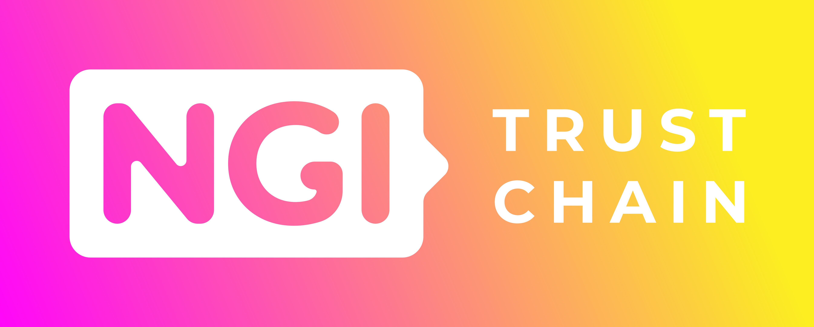

# ssitizens-smart-contracts

## Overview
This project contains the `izToken` smart contract, used to manage a pseudo-cash token. It includes:
- ERC1644 to allow controller operations
- ERC1594 to allow advanced transfer operations and compliance
- UUPS Proxy for upgradeability

## Prerequisites
Before running the project, ensure you have the following installed:

- [Node.js](https://nodejs.org/) (tested with NODE 22)
- [Hardhat](https://hardhat.org/)
- [npm](https://www.npmjs.com/)

## Installation
Clone the repository and install dependencies:

Create a ***.env*** file with. See **.env_EXAMPLE**
```
DEPLOYER_PK: You can extract a private key from Metamask or generate your by yur own. You need balance of crypto if you deploy for a public testnet/public network
SEPOLIA_URL: Url for sepolia network. ***NOTICE: *** vast majority of public endpoints offered by Infura, Alchemy, etcetera will not allow you to deploy contracts.
ETHERSCAN_API_KEY: API Key for validate contracts
``` 
# Install dependencies
```bash
npm install
```

## Compile
For contract compilation
```bash
npm run compile
```

## Test
For contract testing
```bash
npm run test
```

## Coverage
For contract coverage
```bash
npm run coverage
```
This command will generate a HTML format output at coverage/index.html

## Debugging
Typescript test scripts can be debugged using ***Mocha Test Explorer***. It can be installed using Visual Studio Extension manager

## Deployment
First take a look on deployment parameters located on ***hardhat-config.ts*** and modify them if required.

Example:
```js
izDEPLOYMENT: {
    OWNER: "0xD0048fDd48AA86EA23d19F62D2B3fC1B7156Bf48",
    ADMIN: "0x67d13b62479db0cde5Bd21Ed789696999e57ba03",
    NAME: "IzToken",
    SYMBOL: "IZT",
    MIN_TRANSFER: "10000000000000000", // Minimum token transferr allowed (in wei)
    MIN_USER_BALANCE: "20000000000000000", // If user has lower balance must be compensated (in wei)
}
```


### Hardhat network
To deploy on hardhat network:
```sh
$ npx hardhat ignition deploy ignition/modules/DeployIzToken.ts
``` 

To upgrade contract:
```sh
$ npx hardhat ignition deploy ignition/modules/UpgradeModule.ts
```

**NOTICE:** hardhat network will not generate deploymet descriptors. 

**NOTICE:** hardhat network will not store previous deployments. Every deployment need to execute from scratch


### Sepolia


To deploy on Sepolia network:
```sh
$ npx hardhat ignition deploy ignition/modules/DeployIzToken.ts --network sepolia
```

**NOTICE:** Ignition will generate deploymet descriptors on **ignition/deployments/chain-11155111** (11155111 is Sepolia's network Id)

Optional validation after deployment:
```sh
$ npx hardhat ignition verify chain-11155111
```


To upgrade contract:
```sh
$ npx hardhat ignition deploy ignition/modules/UpgradeModule.ts  --network sepolia
```

Optional validation after upgrade:
```sh
$ npx hardhat ignition verify chain-11155111
```

---

## 📢 Credits

This project has received funding from the European Union's Horizon 2020 research and innovation programme within the framework of the LEDGER Project funded under grant agreement No825268.

<p align="center">
  <a href="https://www.ngi.eu" target="_blank">
    
  </a>
  
</p>
